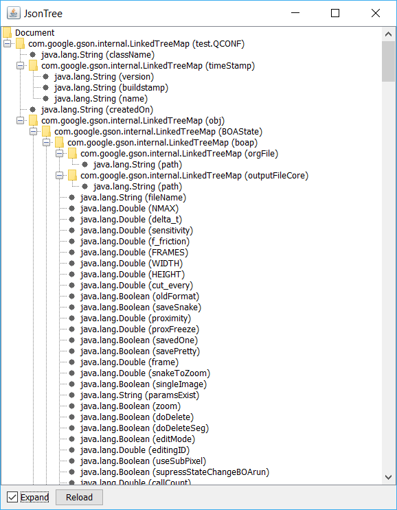

# JsonTree

This simple tool display Json files in form of hierarchical Tree. Text output and GUI are supported. See examples below:

```text
+com.google.gson.internal.LinkedTreeMap (root)
|--java.lang.String (className)
|--+com.google.gson.internal.LinkedTreeMap (timeStamp)
|--|--java.lang.String (version)
|--|--java.lang.String (buildstamp)
|--|--java.lang.String (name)
|--java.lang.String (createdOn)
|--+com.google.gson.internal.LinkedTreeMap (obj)
|--|--+com.google.gson.internal.LinkedTreeMap (BOAState)
|--|--|--+com.google.gson.internal.LinkedTreeMap (boap)
|--|--|--|--+com.google.gson.internal.LinkedTreeMap (orgFile)
|--|--|--|--|--java.lang.String (path)
|--|--|--|--+com.google.gson.internal.LinkedTreeMap (outputFileCore)
|--|--|--|--|--java.lang.String (path)
|--|--|--|--java.lang.String (fileName)
|--|--|--|--java.lang.Double (NMAX)
|--|--|--|--java.lang.Double (delta_t)
|--|--|--|--java.lang.Double (sensitivity)
|--|--|--|--java.lang.Double (f_friction)
|--|--|--|--java.lang.Double (FRAMES)
|--|--|--|--java.lang.Double (WIDTH)
|--|--|--|--java.lang.Double (HEIGHT)
|--|--|--|--java.lang.Double (cut_every)
|--|--|--|--java.lang.Boolean (oldFormat)
|--|--|--|--java.lang.Boolean (saveSnake)
```



## Usage

